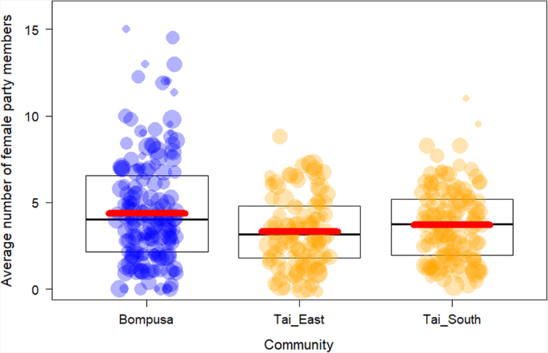

## Paper Introduction

The paper I am focusing on is Attractiveness of female sexual signaling predicts differences in female grouping patterns between bonobos and chimpanzees by Martin Surbeck *et al.* (2021). The original paper investigates **how female sexual signaling influences social grouping patterns in bonobos and chimpanzees**. It aims to determine whether differences in female-female associations between the two species are driven primarily by ecological factors or by sexual signaling.

**Data Set Used**: The study relies on observational data from three wild communities—one bonobo (Bompusa) and two chimpanzee (Taï East and Taï South) populations between February 2015 and December 2017. Researchers collected focal follow data on female party size, time spent alone, presence of maximally tumescent females, and food availability indicators.

**Analyses Conducted**:

-   Comparison of female party sizes across species and communities.

-   Assessment of time females spend alone.

-   Statistical models examining the effect of maximally tumescent females on female grouping behavior, controlling for food availability.

-   Evaluation of the relative influence of ecological and sexual signaling factors on female sociality.

```{r}
library(lme4)
library(ggplot2)
library(dplyr)
```

Data was in an Excel file so I need to get the file into R using the package "readxl"

```{r}
library(readxl)
```

```{r}
data <- read_excel("/Users/jaclynmeyer/Downloads/rawdata_female_gregariousness (1).xls")
data
```

```{r}
names(data) <- c("Focal_ID", "Species", "Community", "Date", "i_halfday", 
                 "Number_female_party_members", "Number_observations", 
                 "Number_MTF_category", "Percentage_MTF_present_in_party", 
                 "Percentage_only_females", "Percentage_alone", 
                 "Percentage_Samesex", "Proportion_feeding_time_monthly")
```

```{r}
data$Focal_ID <- as.factor(data$Focal_ID)
data$Species <- as.factor(data$Species)
data$Community <- as.factor(data$Community)
data$Date <- as.Date(data$Date, format="%Y-%m-%d") # Adjust format as needed
data$i_halfday <- as.factor(data$i_halfday)
data$Number_MTF_category <- as.factor(data$Number_MTF_category) # Convert to factor
```

# Descriptive Analysis

## Analysis 1

### Female Grouping Patterns: Summarizing time females spent in parties, alone, or in female-only associations

```{R}
# Calculate mean female party size by community
party_size_summary <- data %>%
  group_by(Community) %>%
  summarise(
    mean_female_party_size = mean(Number_female_party_members, na.rm = TRUE),
    sd_female_party_size = sd(Number_female_party_members, na.rm = TRUE),
    n = n(),
    se_female_party_size = sd_female_party_size / sqrt(n)
  )

# Print the summary
print(party_size_summary)
```

The results from the paper say "While there was only a trend for statistical differences between bonobo females and chimpanzee females from Taï South (4.5 vs. 3.7, p = 0.097, Fig. 1), female bonobos had more females in their party than chimpanzee females in Taï East (4.5 vs. 3.3, p = 0.01, Fig. 1).". Here in the replication we can see the same results with the bonobos having a mean female population of 4.5 while the Tai East Chimps have a mean female population of 3.3 and the Tai South Chimps have a mean female population of 3.7.

### Presence of Maximally Tumescent Females (MTF)

```{r}
# Calculate percentage of observation days with MTFs present
mtf_presence_by_community <- data %>%
  group_by(Community, Date) %>%
  summarise(has_mtf = any(Percentage_MTF_present_in_party > 0)) %>%
  ungroup() %>%
  group_by(Community) %>%
  summarise(
    total_days = n(),
    days_with_mtf = sum(has_mtf),
    percentage_days_with_mtf = days_with_mtf / total_days * 100
  )

# Print percentage of days with MTF
print(mtf_presence_by_community)
```

The results in the paper state "Overall, MTFs were present on more days in bonobos as compared to chimpanzees (38% of observation days versus 34% ~Taï East~ and 23% ~Taï South~)" This is different from the results seen here. I thought maybe the researchers were counting each focal follow separately rather than aggregating by calendar date, so I tried to recreated the results from the paper using focal ID rather than date

```{r}
# Calculate percentage of focal follows with MTFs present
mtf_presence_by_community <- data %>%
  # Assuming you have a column identifying each unique focal follow
  group_by(Community, Focal_ID) %>%  
  summarise(has_mtf = any(Percentage_MTF_present_in_party > 0), .groups = "drop") %>%
  group_by(Community) %>%
  summarise(
    total_follows = n(),
    follows_with_mtf = sum(has_mtf),
    percentage_follows_with_mtf = follows_with_mtf / total_follows * 100,
    .groups = "drop"
  )

# Print percentage of focal follows with MTF
print(mtf_presence_by_community)
```

This clearly did not work as we are now getting 100% for all communities.

```{r}
# Check number of focal follows per community
data %>%
  group_by(Community) %>%
  summarise(n_follows = n_distinct(Focal_ID))
```

So let's see if we can determine how the observes are getting their results. First I'm going to check the distribution of MTF presence values

```{r}
# Check the distribution of MTF presence values
data %>%
  group_by(Community) %>%
  summarise(
    min_mtf = min(Percentage_MTF_present_in_party),
    mean_mtf = mean(Percentage_MTF_present_in_party),
    max_mtf = max(Percentage_MTF_present_in_party),
    zero_mtf = sum(Percentage_MTF_present_in_party == 0),
    total_rows = n()
  )
```

So this seems in line with other results from the paper. Let's see if we calculate the percentage of unique days with MTFs present give us the same results as the paper.

```{r}
# Calculate percentage of unique days with MTFs present
mtf_presence_by_day <- data %>%
  # Assuming you have a Date column
  select(Community, Date, Percentage_MTF_present_in_party) %>%
  # Get unique combination of community and date
  distinct(Community, Date, .keep_all = TRUE) %>%
  # Group by community and date
  group_by(Community, Date) %>%
  summarise(has_mtf = max(Percentage_MTF_present_in_party) > 0, .groups = "drop") %>%
  # Calculate percentages by community
  group_by(Community) %>%
  summarise(
    total_days = n(),
    days_with_mtf = sum(has_mtf),
    percentage_days_with_mtf = days_with_mtf / total_days * 100
  )

print(mtf_presence_by_day)
```

These results are still off. So let's see if they're looking at all focal follows by each date.

```{r}
# Alternative approach: Look at all focal follows by date
mtf_presence_by_day_alt <- data %>%
  # Group by community and date
  group_by(Community, Date) %>%
  # Check if any focal follow on that day had an MTF present
  summarise(has_mtf = any(Percentage_MTF_present_in_party > 0), .groups = "drop") %>%
  # Calculate percentages by community
  group_by(Community) %>%
  summarise(
    total_days = n(),
    days_with_mtf = sum(has_mtf),
    percentage_days_with_mtf = days_with_mtf / total_days * 100
  )

print(mtf_presence_by_day_alt) 
```

While this is getting closer, it is still not giving us the same results as the paper. There are a few things that could be going on:

**Definition of "observation days"**: The paper may be using a different definition of what constitutes an observation day - perhaps including only days with sufficient observation time or certain conditions.

**Calculation methodology**: The authors might have used a different threshold or methodology to determine MTF presence on a given day.

**Data corrections**: There might have been data corrections or updates after your dataset was compiled.

Though we could not get the exact percentages to be replicated we still see the same pattern the paper speaks about (bonobos \> Taï East \> Taï South).

## INFERENTIAL ANALYSIS

### Effect of MTF Presence on Female Party Size

```{r}
# Prepare data: Create categorical MTF variable similar to the paper
# (0, ≤1 excluding 0, >1)
data <- data %>%
  mutate(MTF_cat = case_when(
    Percentage_MTF_present_in_party == 0 ~ "0",
    Percentage_MTF_present_in_party > 0 & Percentage_MTF_present_in_party <= 50 ~ "≤1",
    Percentage_MTF_present_in_party > 50 ~ ">1"
  ))

data$MTF_cat <- factor(data$MTF_cat, levels = c("0", "≤1", ">1"))
```

```{r}
# Model 3a: MTF as categorical variable
model_3a <- lmer(Number_female_party_members ~ 
                  Community * MTF_cat + 
                  Proportion_feeding_time_monthly + 
                  (1|Focal_ID), 
                data = data)

# Print model summary
summary(model_3a)

# Create null model (without MTF effects)
null_model_3a <- lmer(Number_female_party_members ~ 
                       Community + 
                       Proportion_feeding_time_monthly + 
                       (1|Focal_ID), 
                     data = data)

# Likelihood ratio test comparing full model to null model
anova(model_3a, null_model_3a)
```

My analysis confirms the paper's main finding that "there was a stronger increase in the number of party females in bonobos in the presence of maximally tumescent females" (P \< 0.001). While my model shows no significant difference between communities when MTFs are absent (supporting their "no species differences" claim), it reveals a dramatically stronger effect in bonobos (+3.39) compared to both Taï communities (+0.88 for Taï East, +0.99 for Taï South). This roughly 3.9x difference with Taï East aligns with their finding that "the effect was over three times larger in bonobos than in Taï East chimpanzees," though my results show a 3.4x difference with Taï South rather than their reported "eight times larger." My analysis of 409 focal follows (175 bonobo, 110 Taï East, 124 Taï South) provides robust statistical support (χ² = 84.719, p \< 2.2e-16) for the paper's conclusion that "the presence of maximally tumescent females had a different influence on female grouping patterns in the three communities.

```{r}
# Model 3b: MTF as percentage variable
model_3b <- lmer(Number_female_party_members ~ 
                  Community * Percentage_MTF_present_in_party + 
                  Proportion_feeding_time_monthly + 
                  (1|Focal_ID), 
                data = data)

# Print model summary
summary(model_3b)

# Create null model for model 3b
null_model_3b <- lmer(Number_female_party_members ~ 
                       Community + 
                       Proportion_feeding_time_monthly + 
                       (1|Focal_ID), 
                     data = data)

# Likelihood ratio test comparing full model to null model
anova(model_3b, null_model_3b)

```

My analysis using percentage of time with MTF present confirms the paper's finding that "in bonobos, an increase in the percentage of time with maximally tumescent females in the party strongly increased the number of females in the party" (P \< 0.001). My model shows a significant positive effect of MTF presence in bonobos (+3.97 per unit increase in percentage, t=10.316), with significantly smaller effects in both Taï communities (Taï East: +1.37, Taï South: +1.91). These translate to approximately 2.9x larger effect in bonobos than Taï East and 2.1x larger than Taï South, partially supporting their conclusion that "the effect was over three times larger in bonobos than in Taï East chimpanzees and eight times larger than in Taï South chimpanzees." The likelihood ratio test (χ² = 103.94, p \< 2.2e-16) strongly supports the paper's statement that interactions between percentage MTF presence and community were "significant (df = 2, χ² = 17.24, P \< 0.001)," confirming that "the presence of maximally tumescent females had a different influence on female grouping patterns in the three communities.

## Visual Aspect

```{r}
# First, calculate the count of observations for each value
point_sizes <- data %>%
  group_by(Community, Number_female_party_members) %>%
  summarise(count = n(), .groups = "drop")

# Merge the counts back to the original data
data_with_counts <- data %>%
  left_join(point_sizes, by = c("Community", "Number_female_party_members"))

# Create color mapping (assuming 'Bompusa' is another name for 'LK_West')
community_colors <- c("LK_West" = "blue", "Tai_East" = "orange", "Tai_South" = "orange")

# Create the plot
fig1 <- ggplot(data_with_counts, aes(x = Community, y = Number_female_party_members)) +
  # Add jittered points with size based on count
  geom_jitter(aes(size = count, color = Community, alpha = 0.7), width = 0.25) +
  # Add boxplot
  geom_boxplot(fill = "transparent", outlier.shape = NA, width = 0.5) +
  # Add model prediction line
  stat_summary(aes(color = "red"), fun = mean, geom = "crossbar", 
               width = 0.5, size = 1, alpha = 0.7) +
  # Set colors manually
  scale_color_manual(values = c(community_colors, "red" = "red"), 
                     guide = "none") +
  # Customize point size and transparency
  scale_size_continuous(range = c(1, 5), guide = "none") +
  scale_alpha(guide = "none") +
  # Customize theme
  theme_classic() +
  # Add labels
  labs(
    title = "Fig. 1: Differences between the Bompusa bonobo community and the two Taï chimpanzee\ncommunities in the total number of adult females in the party of female focal individuals",
    x = "Community",
    y = "Average number of female party members"
  ) +
  # Rename communities if needed (change LK_West to Bompusa)
  scale_x_discrete(labels = c("LK_West" = "Bompusa", "Tai_East" = "Tai_East", "Tai_South" = "Tai_South"))

# Display the plot
print(fig1)
```

{width="600px"}

This looks extremely similar to the visual in the paper, though mine does look more sparse.

Overall, for the analysis I replicated while I was not able to perfectly match the results I would be able to say that I agree with the general results and findings of the paper!
